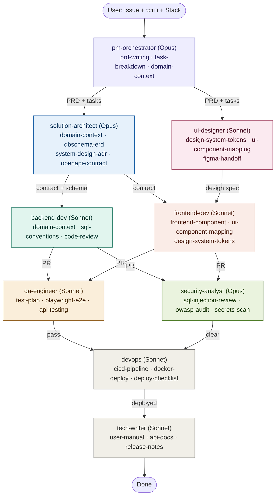

# Agent Skills

10 skills สำหรับ dev office ใน Multica ตามมาตรฐาน Anthropic Agent Skills

---

## Agent flow

> Skills ที่ไม่มีในโฟลเดอร์นี้ (เช่น `system-design-adr`, `owasp-audit`) import จาก ClawHub

---

## Skills ในชุดนี้ (10 ตัว)

| Skill | หน้าที่ | Agent ที่ใช้ |
|---|---|---|
| `prd-writing` | template เขียน PRD | pm-orchestrator |
| `task-breakdown` | แตก task + routing | pm-orchestrator |
| `domain-context` | บริบท domain ของ project ⚠️ | solution-architect, backend-dev, pm-orchestrator |
| `dbschema-erd` | ออกแบบ schema + ERD (รองรับทุก DB engine) | solution-architect |
| `sql-conventions` | convention เขียน SQL (detect engine เอง) | backend-dev |
| `frontend-component` | convention เขียน UI (detect stack เอง) | frontend-dev |
| `ui-component-mapping` | map design element → component ⚠️ | ui-designer, frontend-dev |
| `design-system-tokens` | สี, ฟอนต์, spacing ⚠️ | ui-designer, frontend-dev |
| `sql-injection-review` | ตรวจ SQL injection ก่อน merge | security-analyst |
| `user-manual` | style + โครง user manual ⚠️ | tech-writer |

> ⚠️ = มี placeholder ต้องเติมค่าจริงก่อนใช้ (หรือให้ PM bootstrap จาก issue แรก)

---

## วิธี import

**แนะนำ — From local** (เร็วสุด)
1. แตก zip แล้ว copy folder `agent-skills/` ไปไว้ที่ `~/.claude/skills/`
2. Multica → Settings → Skills → From local
3. Daemon scan เจอทั้ง 10 skills ให้เลือก import ได้ทีเดียว

**From GitHub**
Push repo แล้ว import ทีละ skill โดยวาง URL เช่น
`https://github.com/<you>/<repo>/tree/main/agent-skills/domain-context`

**Manual (New)**
เปิด `SKILL.md` แล้ว copy-paste เนื้อหาเข้า Settings → Skills → New

---

## หมายเหตุ

- skills อ้างถึงกันเอง — attach เป็นชุดตามตารางข้างบนจะได้ผลดีสุด
- `domain-context` ถ้ามีชื่อระบบภายใน sensitive แนะนำเก็บเป็น local / private skill
- แก้ skill หลัง task รันอยู่แล้ว — เฉพาะ task ใหม่ถึงจะได้เวอร์ชันใหม่
